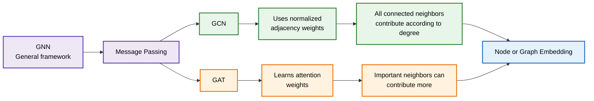

# Awesome Graph Neural Network ([**GNN**](https://wikipedia.org/wiki/Graph_neural_network))

```mermaid
flowchart LR
    GNN["GNN<br/>General framework"] --> MP["Message Passing"]

    MP --> GCN["GCN"]
    MP --> GAT["GAT"]

    GCN --> GCNA["Uses normalized<br/>adjacency weights"]
    GAT --> GATA["Learns attention<br/>weights"]

    GCNA --> GCNF["All connected neighbors<br/>contribute according to degree"]
    GATA --> GATF["Important neighbors can<br/>contribute more"]

    GCNF --> OUT["Node or Graph Embedding"]
    GATF --> OUT

    classDef general fill:#ede7f6,stroke:#5e35b1,stroke-width:2px,color:#000
    classDef gcn fill:#e8f5e9,stroke:#2e7d32,stroke-width:2px,color:#000
    classDef gat fill:#fff3e0,stroke:#ef6c00,stroke-width:2px,color:#000
    classDef output fill:#e3f2fd,stroke:#1565c0,stroke-width:2px,color:#000

    class GNN,MP general
    class GCN,GCNA,GCNF gcn
    class GAT,GATA,GATF gat
    class OUT output
```
